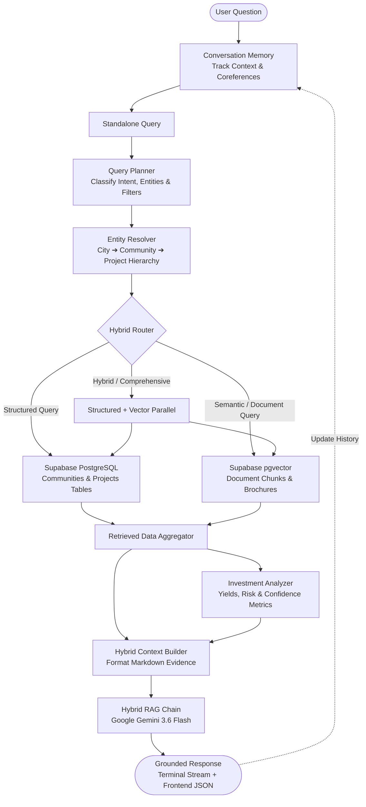

# ACOT AI — Dubai Real Estate Intelligence Engine

<p align="center">
  <strong>Grounded Multi-Modal Real Estate Intelligence & Hybrid RAG Assistant for Dubai Properties</strong>
</p>

---

## 📌 Table of Contents

- [Overview](#-overview)
- [Key Features](#-key-features)
- [System Architecture](#-system-architecture)
- [Directory Structure](#-directory-structure)
- [Core Components & Pipeline](#-core-components--pipeline)
  - [1. Conversational Memory](#1-conversational-memory)
  - [2. Query Planner](#2-query-planner)
  - [3. Entity Resolver](#3-entity-resolver)
  - [4. Dual-Path Hybrid Retriever](#4-dual-path-hybrid-retriever)
  - [5. Investment Analyzer](#5-investment-analyzer)
  - [6. Context Builder](#6-context-builder)
  - [7. Grounded Hybrid RAG Chain](#7-grounded-hybrid-rag-chain)
  - [8. Document Ingestion Pipeline](#8-document-ingestion-pipeline)
- [Database & Vector Store Schema](#-database--vector-store-schema)
- [Prerequisites & System Requirements](#-prerequisites--system-requirements)
- [Installation & Setup](#-installation--setup)
- [Configuration (.env)](#-configuration-env)
- [Running the Application](#-running-the-application)
- [Interactive Evaluation & Sample Queries](#-interactive-evaluation--sample-queries)
- [Testing Suite](#-testing-suite)
- [Strict Grounding & Safety Guidelines](#-strict-grounding--safety-guidelines)
- [License](#-license)

---

## 🌟 Overview

**ACOT AI** is an enterprise-grade AI intelligence system engineered specifically for the Dubai real estate market. Unlike generic conversational bots, ACOT is designed to eliminate hallucinations by anchoring every answer in verified ground-truth data:
1. **Relational PostgreSQL Data**: Live, structured property listings, developers, pricing, bedroom counts, completion statuses, and community metrics stored in Supabase.
2. **Dense Vector Embeddings (`pgvector`)**: 384-dimensional dense vectors (`all-MiniLM-L6-v2`) of official Dubai Land Department (DLD) annual reports, Dubai Municipality Building Codes, and official developer project brochures.
3. **Deterministic Financial Modeling**: Automated calculation of rental yield percentiles, project status distributions, risk scores, and data confidence metrics.
4. **Strictly Grounded LLM Generation**: Backed by Google Gemini (`gemini-3.6-flash`), enforced by rigid system-level grounding constraints that forbid extrapolation, external market conjecture, or unit alterations.

---

## ✨ Key Features

- **Dual-Path Hybrid Retrieval**: Combines exact SQL filtering (PostgreSQL) with semantic vector search (`pgvector`) to satisfy both structured queries (*"2-bedroom apartments under 2.5M AED in JVC"*) and unstructured queries (*"What are the safety and fire codes according to Dubai Municipality?"*).
- **Short-Term Conversational Memory & Coreference Resolution**: Resolves relative follow-ups (*"Which of these have 2-bedroom options?"*, *"What are their starting prices?"*, *"Compare the first and second ones"*) without losing entity context across multi-turn dialogs.
- **Hierarchical Entity Resolution**: Deterministically resolves geographic relationships (`City` ➔ `Community` ➔ `Sub-community` ➔ `Project`) against live database records with fuzzy-matching fallbacks.
- **Deterministic Investment Analytics**: Evaluates market positioning, off-plan vs. ready risk profiles, and rental yield metrics without relying on LLM arithmetic or guesswork.
- **Zero-Hallucination Guarantees**: Follows 10 Core Grounding Commandments: does not assume future handovers mean off-plan unless stated, never fabricates missing stats, preserves exact AED/sqft units, and distinguishes between developer claims and verified facts.
- **Sequential Terminal Streaming & Frontend JSON Payload**: Offers real-time character typewriter rendering for interactive CLI use alongside structured JSON responses for frontend UI integration.

---

## 🏗️ System Architecture



---

## 📁 Directory Structure

```text
Acot-AI/
├── .env                              # Environment credentials (API keys, Supabase)
├── .gitignore                        # Git exclusion rules
├── pyproject.toml                    # Package metadata and build definitions
├── requirements.txt                  # Pinned Python package dependencies (UTF-8)
├── run.py                            # Interactive CLI entry point and orchestrator
├── Question.txt                      # Benchmark evaluation questions
├── app/
│   ├── __init__.py
│   ├── main.py                       # Application entry point / FastAPI stub
│   ├── api/                          # REST API interfaces
│   │   ├── __init__.py
│   │   └── routes/
│   │       ├── __init__.py
│   │       └── chat.py               # HTTP chat endpoints
│   ├── core/
│   │   ├── __init__.py
│   │   └── config.py                 # App settings & Gemini API keys
│   ├── database/
│   │   ├── __init__.py
│   │   └── supabase_client.py        # Supabase client singleton
│   ├── graph/                        # LangGraph agentic workflows & state nodes
│   │   ├── __init__.py
│   │   ├── graph.py
│   │   └── nodes/
│   │       ├── __init__.py
│   │       ├── rag_node.py
│   │       └── router.py
│   ├── intelligence/
│   │   ├── __init__.py
│   │   └── investment_analyzer.py    # Deterministic rental yield & risk analyzer
│   ├── llm/
│   │   ├── __init__.py
│   │   └── client.py                 # Resilient Gemini API client with backoff
│   ├── memory/
│   │   ├── __init__.py
│   │   └── conversation_memory.py    # Multi-turn memory & coreference resolver
│   ├── rag/
│   │   ├── __init__.py
│   │   ├── chains/
│   │   │   ├── __init__.py
│   │   │   ├── rag_chain.py
│   │   │   └── hybrid_rag_chain.py   # Grounded prompt construction & Gemini answer generation
│   │   ├── embeddings/
│   │   │   ├── __init__.py
│   │   │   └── embedding_model.py    # SentenceTransformers (all-MiniLM-L6-v2, 384-dim)
│   │   ├── ingestion/                # Document ETL & Vector ingestion pipeline
│   │   │   ├── __init__.py
│   │   │   ├── chunker.py            # Text chunking logic
│   │   │   ├── content_extractor.py  # Text and HTML content extractor
│   │   │   ├── document_validator.py # Document validation and schema checking
│   │   │   ├── ingest.py             # Pipeline orchestrator (Fetch ➔ Clean ➔ Chunk ➔ Embed)
│   │   │   ├── project_text_builder.py # Rich project textual synthesizer
│   │   │   ├── populate_community_embeddings.py # Vector embedding populator
│   │   │   ├── source_detector.py    # File and URL format detector
│   │   │   ├── supabase_embedding_writer.py # Database vector batch writer
│   │   │   ├── text_cleaner.py       # Normalization and boilerplate removal
│   │   │   └── url_fetcher.py        # Resilient HTTP fetcher
│   │   ├── loaders/                  # Raw document format loaders
│   │   │   ├── __init__.py
│   │   │   ├── document_loader.py
│   │   │   ├── json_loader.py
│   │   │   ├── pdf_loader.py
│   │   │   └── url_loader.py
│   │   └── processing/               # Text processing utilities
│   │       ├── __init__.py
│   │       ├── chunker.py
│   │       ├── cleaner.py
│   │       └── metadata.py
│   ├── retrieval/
│   │   ├── __init__.py
│   │   ├── community_detector.py     # Community regex & lookup detector
│   │   ├── hybrid/                   # Intelligent query routing & context compilation
│   │   │   ├── __init__.py
│   │   │   ├── context_builder.py    # Synthesizes structured data & vector snippets
│   │   │   ├── entity_resolver.py    # Maps names to database entities (City/Comm/Proj)
│   │   │   ├── hybrid_retriever.py   # Master hybrid retrieval engine
│   │   │   ├── query_planner.py      # Deconstructs questions into structured query plans
│   │   │   ├── relevance_filter.py   # Filters low-similarity vector hits
│   │   │   └── router.py             # Rule-based and intent router
│   │   └── supabase/                 # Database retrieval implementations
│   │       ├── __init__.py
│   │       ├── pgvector_retriever.py # Community & document chunk semantic search
│   │       ├── project_vector_retriever.py # Project-level semantic search
│   │       ├── structured_retriever.py # Direct PostgreSQL queries (Communities/Projects)
│   │       └── supabase_client.py    # Supabase connection client
│   └── schemas/
│       ├── __init__.py
│       └── chat.py                   # Pydantic request/response schemas
├── data/
│   ├── processed/                    # Cleaned and chunked datasets
│   └── raw/                          # Raw reference data
│       ├── documents.json            # 50 synthetic benchmark records with official URLs
│       ├── regulations/              # Dubai Municipality building codes & guidelines
│       ├── reports/                  # DLD real estate sector annual reports
│       └── research/                 # Market research articles
├── scripts/
│   └── ingest_documents.py           # Ingestion batch runner script
└── tests/                            # Comprehensive automated testing suite (27+ tests)
    ├── __init__.py
    ├── test_brochure_chunking.py
    ├── test_brochure_embeddings.py
    ├── test_brochure_pgvector_search.py
    ├── test_brochure_supabase_insert.py
    ├── test_brochure_validation.py
    ├── test_chunker.py
    ├── test_cleaner.py
    ├── test_cleaner_chunker.py
    ├── test_content_extractor.py
    ├── test_context_pgvector.py
    ├── test_embedding.py
    ├── test_embedding_model.py
    ├── test_gemini.py
    ├── test_hybrid_router.py
    ├── test_ingest.py
    ├── test_pgvector_retriever.py
    ├── test_project_embedding_write.py
    ├── test_project_text_builder.py
    ├── test_project_vector_retriever.py
    ├── test_rag.py
    ├── test_router.py
    ├── test_source_detector.py
    ├── test_supabase.py
    ├── test_supabase_pgvector.py
    ├── test_supabase_structured.py
    └── test_url_fetcher.py
```

---

## ⚙️ Core Components & Pipeline

### 1. Conversational Memory
- **Module**: `app/memory/conversation_memory.py`
- Retains up to **8 conversation turns** and tracks active context: `city`, `community`, `sub_community`, `project`, and `developer`.
- Resolves relative references and anaphora (e.g., *"Which of these have 2 bedrooms?"* or *"Compare the first and second"*) by looking up the latest candidate list.
- Rewrites ambiguous follow-up questions into self-contained standalone questions before execution.

### 2. Query Planner
- **Module**: `app/retrieval/hybrid/query_planner.py`
- Employs an LLM semantic planner (with deterministic rule fallbacks) to classify:
  - **Intent**: `investment`, `comparison`, `ranking`, `search`, `information`, `document`.
  - **Constraints / Filters**: Price bounds, bedroom minimum/maximum, specific property types.
  - **Required Modalities**: Flags whether structured PostgreSQL rows, vector document chunks, or deterministic analytics are needed.

### 3. Entity Resolver
- **Module**: `app/retrieval/hybrid/entity_resolver.py`
- Performs exact and fuzzy hierarchical mapping against live database entities:
  $$\text{City (Dubai)} \longrightarrow \text{Community} \longrightarrow \text{Sub-community} \longrightarrow \text{Project}$$
- Employs `SequenceMatcher` to tolerate typos while preventing false positive community-to-project collisions.

### 4. Dual-Path Hybrid Retriever
- **Module**: `app/retrieval/hybrid/hybrid_retriever.py`
- Coordinates data retrieval across two distinct paths:
  1. **Structured PostgreSQL (`SupabaseStructuredRetriever`)**: Executes exact parameter queries on `communities`, `projects`, and `sub_communities` tables with price, bedroom, and keyword filters.
  2. **Vector Retrieval (`SupabasePGVectorRetriever`)**: Uses `all-MiniLM-L6-v2` dense embeddings to query PostgreSQL RPCs (`match_communities`, `match_document_chunks`) for conceptual similarity.

### 5. Investment Analyzer
- **Module**: `app/intelligence/investment_analyzer.py`
- Generates transparent, deterministic financial signals:
  - **Rental Yield Analysis**: Yield range, benchmark comparison, and yield percentile classification.
  - **Development Exposure**: Breakdown of `READY` vs. `OFF_PLAN` vs. `UNDER_CONSTRUCTION` properties.
  - **Risk vs. Confidence**: Quantifies investment risk separately from data confidence (so low sample sizes do not distort the project's inherent risk score).

### 6. Context Builder
- **Module**: `app/retrieval/hybrid/context_builder.py`
- Formats retrieved data into structured Markdown blocks for the LLM:
  - `STRUCTURED COMMUNITY DATA`
  - `STRUCTURED PROJECT DATA` (developer, handover date, pricing, bedrooms, amenities, brochures)
  - `DOCUMENT & BROCHURE EVIDENCE` (extracted passages, official URLs, publishers, similarity scores)
  - `DETERMINISTIC INVESTMENT ANALYSIS`

### 7. Grounded Hybrid RAG Chain
- **Module**: `app/rag/chains/hybrid_rag_chain.py`
- Communicates with Google Gemini via `GeminiClient` (`gemini-3.6-flash`).
- Injects the Grounding Commandments ensuring that:
  - Missing fields are reported as *"not specified in available records"*, not inferred as zero.
  - Handover dates are never conflated with development status without explicit evidence.
  - All numerical values, currencies (AED), and areas (sqft) are reproduced verbatim.

### 8. Document Ingestion Pipeline
- **Module**: `app/rag/ingestion/`
- Automated ingestion workflow:
  1. `SourceDetector`: Identifies document type (PDF, JSON, web URL).
  2. `URLFetcher`: Streams remote files with retry logic and mime-type detection.
  3. `ContentExtractor` & `TextCleaner`: Strips web boilerplate, extracts text, and normalizes whitespaces.
  4. `TextChunker`: Chunks text using sliding windows with configurable overlap.
  5. `EmbeddingModel`: Computes 384-dimensional dense vectors using `SentenceTransformers`.
  6. `SupabaseEmbeddingWriter`: Inserts embeddings into `document_chunks` with metadata.

---

## 🗄️ Database & Vector Store Schema

The system uses Supabase (PostgreSQL with `pgvector` extension enabled):

### Table: `communities`
| Column | Type | Description |
|---|---|---|
| `id` | `uuid` / `serial` (PK) | Unique community identifier |
| `name` | `text` | Community name (e.g., *"Jumeirah Village Circle"*) |
| `city` | `text` | City name (e.g., *"Dubai"*) |
| `projects_count` | `int` | Total registered projects |
| `pool_projects_count` | `int` | Number of pool-associated projects |
| `source` | `text` | Ingestion source identifier |
| `embedding` | `vector(384)` | Community description embedding |

### Table: `projects`
| Column | Type | Description |
|---|---|---|
| `id` | `uuid` / `serial` (PK) | Unique project identifier |
| `name` | `text` | Project name (e.g., *"Sky Edition at Seahaven"*) |
| `developer_name` | `text` | Developer name (e.g., *"Sobha"*) |
| `city` | `text` | City location |
| `community` | `text` | Community association |
| `sub_community` | `text` | Sub-community association |
| `price` | `numeric` | Starting price in AED |
| `bedroom_min` / `max` | `int` | Bedroom range |
| `handover_time` | `text` / `date` | Estimated completion date |
| `property_types` | `text[]` / `jsonb` | Apartment, Villa, Penthouse, etc. |
| `amenities` | `text[]` / `jsonb` | Extracted amenities and features |
| `brochure_url` | `text` | Link to official brochure |
| `property_finder_url` | `text` | External listing reference |
| `embedding` | `vector(384)` | Project profile embedding |

### Table: `document_chunks`
| Column | Type | Description |
|---|---|---|
| `id` | `uuid` / `serial` (PK) | Chunk primary key |
| `document_id` | `text` | Catalog document ID (e.g., `DLD-RE-2024-ANNUAL`) |
| `document_title` | `text` | Document name |
| `publisher` | `text` | Publishing entity (e.g., *Dubai Land Department*) |
| `chunk_id` | `int` | Sequence index |
| `content` | `text` | Chunk body text |
| `source_url` | `text` | Official document URL |
| `embedding` | `vector(384)` | Dense chunk vector (384 dimensions) |

### Vector Match RPCs:
- `match_communities(query_embedding vector(384), match_threshold float, match_count int)`
- `match_document_chunks(query_embedding vector(384), match_threshold float, match_count int)`

---

## 📋 Prerequisites & System Requirements

- **Python**: **3.10+** (Python 3.11 recommended; macOS built-in Python 3.9 is **not** supported due to dependency requirements).
- **Package Manager**: `pip` (upgraded to latest)
- **Supabase Account**: With PostgreSQL and `pgvector` extension enabled.
- **Google Cloud / Gemini API Key**: With access to `gemini-3.6-flash`.

---

## 🚀 Installation & Setup

### 1. Clone the Repository
```bash
git clone <repository-url>
cd Acot-AI-
```

### 2. Prepare Virtual Environment (Python 3.11+)

If using Homebrew on macOS:
```bash
# Verify Python 3.11 is installed
python3.11 --version

# Create virtual environment
python3.11 -m venv .venv

# Activate virtual environment
source .venv/bin/activate
```

*(On Windows)*:
```powershell
python -m venv .venv
.venv\Scripts\Activate.ps1
```

### 3. Upgrade pip and Install Dependencies
```bash
python -m pip install --upgrade pip
pip install -r requirements.txt
```

---

## 🔐 Configuration (.env)

Create or update the `.env` file in the root directory:

```env
# Google Gemini API
GEMINI_API_KEY=your_gemini_api_key_here

# Supabase Credentials
SUPABASE_URL=https://your-project-id.supabase.co
SUPABASE_SECRET_KEY=your_supabase_service_role_or_secret_key
```

> **Warning**: Never commit your secret keys to public version control. Ensure `.env` is listed in `.gitignore`.

---

## 💻 Running the Application

Launch the interactive terminal chat:

```bash
python run.py
```

### Command-line Experience:
1. Components initialize quietly in the background.
2. The user enters real estate queries at the `Question: ` prompt.
3. The response is rendered dynamically using a smooth progressive typewriter output.
4. Type `exit` or `quit` (or press `Ctrl+C`) to terminate.

---

## 🧪 Interactive Evaluation & Sample Queries

The system is tested against the evaluation questions located in [`Question.txt`](file:///Users/apple/Ryzer-RWA/Ryzer-Repos/ACOT/Acot-AI-/Question.txt):

| Query Type | Example Query | Expected Retrieval Strategy |
|---|---|---|
| **Specific Project Pricing** | *"What is the price of Sky Edition at Seahaven?"* | Structured project lookup for `Sky Edition at Seahaven`. |
| **Amenities & Features** | *"Tell me the price and amenities of Sky Edition at Seahaven."* | Hybrid: Structured price + vector chunk search in project brochure. |
| **Specifications & Developer** | *"What is the handover date, developer, and bedroom range of Sky Edition at Seahaven?"* | Exact field extraction from `projects` table. |
| **Project Comparison** | *"What makes Sky Edition at Seahaven different from other projects in the available data?"* | Comparative synthesis across community peers. |
| **Market / City Overview** | *"What projects are available in Dubai?"* | Aggregated community and project listing across Dubai. |
| **Investment Viability** | *"Is Dubai a good investment based on the available data?"* | Deterministic `InvestmentAnalyzer` execution over DLD benchmarks. |
| **Community Filtering** | *"Show me the best properties in Jumeirah Village Circle."* | Community resolution to `Jumeirah Village Circle` + ranking. |
| **Multi-turn Follow-up 1** | *"Show me the projects in Jumeirah Village Circle."* | Community project retrieval. Memory tracks candidate projects. |
| **Multi-turn Follow-up 2** | *"Which of these have 2-bedroom options?"* | Coreference resolution: filters candidates where `bedroom_min <= 2 <= bedroom_max`. |
| **Multi-turn Follow-up 3** | *"What are their starting prices?"* | Extracts `price` for the active filtered subset. |
| **Multi-turn Follow-up 4** | *"Compare the first and second ones based on price, bedroom range, handover date, and documented amenities."* | Resolves positional entities (`first`, `second`) and constructs a comparative table. |

---

## 🔬 Testing Suite

ACOT AI includes an extensive automated test suite covering all critical subsystems. Run tests directly via `pytest`:

```bash
# Run all tests
pytest tests/

# Run individual subsystems
pytest tests/test_supabase_structured.py      # PostgreSQL table retrieval
pytest tests/test_supabase_pgvector.py        # Vector similarity queries
pytest tests/test_hybrid_router.py            # Intent and keyword routing
pytest tests/test_gemini.py                   # LLM client & retry mechanisms
pytest tests/test_chunker.py                  # Text chunking logic
```

---

## 🛡️ Strict Grounding & Safety Guidelines

ACOT AI enforces strict operational boundaries:

1. **No External Hallucinations**: Zero assumptions regarding off-plan statuses, unverified rental yields, or speculative infrastructure projects.
2. **Missing Information Integrity**: When a database field is null or unspecified, ACOT explicitly informs the user rather than inventing placeholders.
3. **Verified Fact Attribution**: Clearly separates official government figures (DLD/Municipality) from developer marketing claims.
4. **Verbatim Preservation**: Preserves currencies (AED), area measurements (sqft), percentages, and timeline dates exactly as documented.
5. **No Direct Financial Advice**: Investment metrics and yields are presented strictly as deterministic data observations based on available records.

---

## 📄 License

This project is proprietary and confidential. All rights reserved by Ryzer RWA / ACOT AI.
