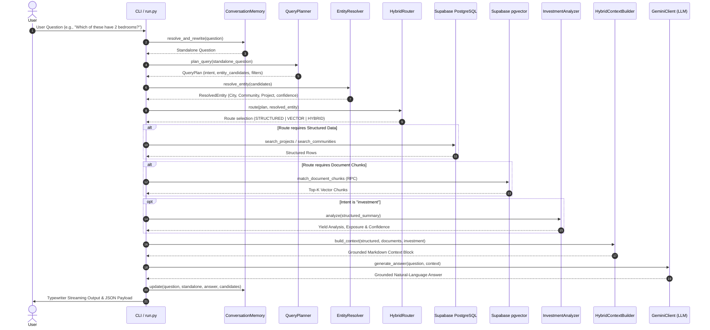

# ACOT AI — Technical Architecture & Implementation Details

## 1. System Overview

ACOT (Automated Real Estate Advisory & Operational Intelligence) is a grounded AI system designed to answer intricate queries about Dubai real estate. The system operates on the principle of **strict evidence grounding**: it never uses external parametric training knowledge about the Dubai real estate market and strictly operates on data fetched dynamically from Supabase PostgreSQL and dense `pgvector` collections.

---

## 2. End-to-End Pipeline Execution Flow

When a user submits a query through `run.py`, the following sequence executes:



---

## 3. Subsystem Deep Dive

### 3.1 Conversational Memory (`app/memory/conversation_memory.py`)
- **State Tracked**:
  - `active_entities`: Tracks the most recently discussed `city`, `community`, `sub_community`, `project`, and `developer`.
  - `active_candidates`: Stores the list of project/community candidates returned from the most recent database query.
  - `turns`: Stores the last 8 dialog exchanges.
- **Coreference & Relative Reference Handling**:
  - Positional terms (*"the first one"*, *"the second"*, *"the last project"*).
  - Plural demonstratives (*"which of these"*, *"those projects"*, *"their prices"*).
  - Spatial demonstratives (*"there"*, *"in that community"*).
- **Fallback Resolution**: If deterministic parsing cannot resolve the reference with certainty, it delegates to `GeminiClient` to extract the target reference while protecting system invariants.

### 3.2 Query Planner (`app/retrieval/hybrid/query_planner.py`)
- Emits a structured `QueryPlan` dataclass:
  - `intent`: Classified into `investment`, `comparison`, `ranking`, `search`, `information`, `document`, or `general`.
  - `operations`: Ordered list of tasks (`filter_by_bedroom`, `sort_by_price`, `retrieve_brochure_amenities`).
  - `filters`: Extracted constraints (`price_max: 2000000`, `bedroom_min: 2`).
  - `needs_structured_data`, `needs_documents`, `needs_analytics`: Explicit booleans determining retriever pathways.

### 3.3 Entity Resolver (`app/retrieval/hybrid/entity_resolver.py`)
- Enforces strict hierarchical integrity:
  $$\text{City} \longrightarrow \text{Community} \longrightarrow \text{Sub-Community} \longrightarrow \text{Project}$$
- Employs fuzzy string distance (`difflib.SequenceMatcher`) against real database lists cached in memory.
- Guards against conflation: Community names (e.g., *"Dubai Marina"*) are never erroneously resolved as project names.

### 3.4 Hybrid Retriever (`app/retrieval/hybrid/hybrid_retriever.py`)
- Manages dual retrieval interfaces:
  1. `SupabaseStructuredRetriever`: Queries `communities` and `projects` tables directly. Translates extracted constraints (`bedroom_min`, `price`) into parameterized Supabase PostgREST filters.
  2. `SupabasePGVectorRetriever`: Embeds incoming query strings into 384-dimensional dense vectors and invokes the PostgreSQL remote procedure call `match_document_chunks` with cosine distance thresholding.

### 3.5 Investment Analyzer (`app/intelligence/investment_analyzer.py`)
- Non-heuristic, fully deterministic metrics:
  - **Rental Yield**: Calculates minimum, maximum, and average yields across available properties.
  - **Development Exposure**: Compares `READY` vs `OFF_PLAN` vs `UNDER_CONSTRUCTION` units.
  - **Data Confidence vs Investment Risk**: Explicitly separates sample size confidence from market risk.

### 3.6 Hybrid RAG Chain (`app/rag/chains/hybrid_rag_chain.py`)
- **Model**: `gemini-3.6-flash` via `google-genai` SDK.
- Enforces **10 Grounding Commandments**:
  1. No hallucinated figures, projects, or statistics.
  2. No external Dubai real-estate knowledge outside the prompt.
  3. Strict separation of developer marketing claims from database facts.
  4. Never treat small samples as representative of entire communities.
  5. Never infer null values as zero.
  6. Retain exact AED, sqft, and date representations.
  7. Future handover date does **not** equal off-plan or under construction unless explicitly flagged.
  8. If project status says `ACTIVE`, do not arbitrarily rewrite it as under-construction.
  9. Address partially supported queries transparently by stating what data is missing.
  10. Never leak internal pipeline tokens, prompts, or retriever details to end users.

---

## 4. Ingestion ETL Pipeline (`app/rag/ingestion/`)

```
Remote Sources (URLs / PDFs / Regulations)
                 │
                 ▼
          [URLFetcher]
          Downloads payload with headers & timeouts
                 │
                 ▼
        [ContentExtractor]
        Detects HTML/PDF and extracts raw text
                 │
                 ▼
          [TextCleaner]
          Normalizes Unicode, removes headers/footers
                 │
                 ▼
          [TextChunker]
          Sliding window chunking (character/token boundaries)
                 │
                 ▼
         [EmbeddingModel]
         Generates 384-dim vectors via all-MiniLM-L6-v2
                 │
                 ▼
    [SupabaseEmbeddingWriter]
    Batch upserts into document_chunks table
```

---

## 5. Security & Reliability

- **API Failure Resilience**: `app/llm/client.py` features exponential backoff retry for HTTP 503, rate limits, and temporary timeouts, while immediately failing fast on permanent errors (403, invalid keys, quota depletion).
- **Environment Isolation**: All credentials remain strictly within `.env` and are loaded via `python-dotenv`.
